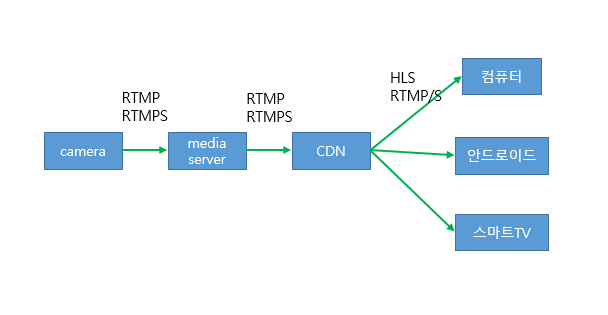
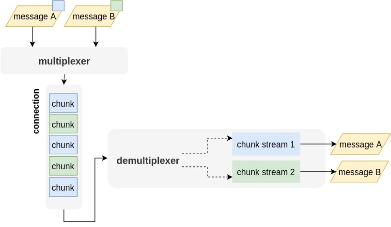

# RTMP 번역 및 정리

# Reference

[참고#1](https://blog.pogrebnyak.info/what-is-rtmp-and-how-its-used-in-live-streaming/#rtmp-quick-characteristics)

[참고#2](https://wwwimages2.adobe.com/content/dam/acom/en/devnet/rtmp/pdf/rtmp_specification_1.0.pdf) (RTMP규격서)

# 내용
어도비 사의 미디어 전송 프로토콜   
주로 encoder -> media server 또는 media server -> CDN 전송시 많이 사용된다   
실시간성으로 잠시 기다렸다가 재생하지 못한다   
TCP 기반으로 frame 유실이 없다. 네트워크 문제시 지연이 UDP 보다 더 심하게 발생한다   
기본 포트는 1935이다.
여러 조각(fragment)으로 나누어 전송한다 ( chunk stream )    
H264, AAC 를 제외한 최신 Codec을 지원하지 않는다 ( 예: VP8, VP9, H265, opus 등 )




# RTMP의 특징/특성
- Chcunk Stream

## RTMP Chunk Stream

여러개의 메시지를 묶어 전송합니다.   
전송단에서는 패킷을 multiplexing 하여 전송, 수신단에서는 demultiplexing 및 interleaving 하여 처리.    
즉, 전송단은 video, audio, script, control 데이터를 모두 묶어서 전송. 
장점 : 시스템콜을 최소화, 대용량 메시지 전송시 유리 ( 전송 성능 개선 )   
단점 : 즉시 전송하지는 않으니 delay 발생 가능   



# Flow
1. handshake
2. connect
3. createStream
4. play
5. deleteStream
6. receiveAudio
7. receiveVideo
8. publish
9. seek
10. pause
11. getStreamLength


### 1. handshake
TCP connection 이후 
C >> C1 C0     >> S
C << S0 S1 S2  << S
C >> C2        >> S

tcp 연결 후 handshake 과정을 수행해야한다.
클라이언트가 먼저 handshake C0+C1 를 전송하며, 데이터는 C0(버전) , C1(시간, 랜덤값) 이다.
서버가 handshake S0+S1+S2 를 응답하며, 데이터는 S0(버전), S1(시간 ,랜덤), S2(C1) 이다.
클라이언트가 마지막으로 handshake C2를 응답하며, S2를 채워 전송한다.

### connect   
```
            Message flow in the connect command
 +--------------+                              +-------------+
 | Client       |              |               |   Server    |
 +------+-------+              |               +------+------+
        |              Handshaking done               |
        |                      |                      |
        |                      |                      |
        |                      |                      |
        |                      |                      |
        |----------- Command Message(connect) ------->|
        |                                             |
        |<------- Window Acknowledgement Size --------|
        |                                             |
        |<----------- Set Peer Bandwidth -------------|
        |                                             |
        |-------- Window Acknowledgement Size ------->|
        |                                             |
        |<------ User Control Message(StreamBegin) ---|
        |                                             |
        |<------------ Command Message ---------------|
        |        (_result- connect response)          |
        |                                             |

```
handshake 이후 connect 메시지를 전송한다.   
C -> S : connect('앱이름')
S -> C : Window Acknowledgement Size
S -> C : Set Peer Bandwidth, Set Chunk Size, AMF Command Result('Connect.Success')
C -> S : Window Acknowledgement Size
S -> C : User Control Message (StreamBegin)
S -> C : _result(connect response)


- connect('앱이름')
```
HEADER : 
AMF Control
BODY : 
'connect'
TransactionId = 0x01(TRANSACTION_CONNECT)
Start Object

"app" : "앱이름"   
"flashVer" : "LNX 9,0,124,2"   
"tcUrl" : "rtmp://sanghotest.iptime.org:1935/앱이름"   
"fpad" : false   
"capabilities" : 15   
"audioCodecs" : 4071   
"videoCodecs" : 252  

End Of Object Marker
```

- Window Acknowlegement Size
```
HEADER : 
Window Acknowlegement Size
BODY : 
5000000
```

S -> C : Set Peer Bandwidth, Set Chunk Size, AMF Command Result('Connect.Success')
```
HEADER:
Set Peer Bandwidth
BODY:
5000000
HEADER:
Window acknowlegement size
BODY:
5000000
HEADER:
AMF0 Command
BODY:
'_result'
...??
```

C -> S : Window Acknowledgement Size
```
HEADER : 
Window Acknowlegement Size
BODY :
5000000
AMF0 Command
BODY :
String createStream
Number 2
```

S -> C : User Control Message (StreamBegin)
```
HEADER :
User Control Message
BODY :
Stream Begin
```


```
HEADER :
AMF0 Command
BODY :
String 'onStatus'

HEADER :
AMF0 Data
BODY :
String 'onMetaData'

HEADER :
Audio Data
BODY :
Control, Audio data

HEADER :
Audio Data
BODY :
Audio Data
BODY :
Control, Audio data
...

HEADER :
Video Data
BODY :
Video Data
..
```


streamer
handshake
connect
Window Acknowlegement Size
Set Peer Bandwidth, Set Chunk Size, _result

Set Chunk Size|releaseStream('')|FCPublish('')|createStream()

_result()

publish('')

onStatus('NetStream.Publish.Start)

setDataFrame()|Video Data|Audio Data
Audio Data
...
Video Data
...


VideoData|FCUnpublish()|deleteStream()
onStatus('NetStream.Unpublish.Success')


### 


# Message Packet 
1. RTMP Chunk Format
2. Chunk Basic Header   
3. Chunk Message Header

## 1. RTMP Chunk Format ( p 11 )
Chunk stream 포멧은 Basic Header, Message Header, Extended Timestamp, Chunk Data 4개로 분류될 수 있다.
- Basic Header(1~3Bytes) : Chunk Type과 Chunk Stream ID 를 인코딩. Chcunk Type은 Message Header의 포멧을 결정하며, Chcunk Stream ID는 length를 결정한다.
- Message Header(0, 3, 7 or 11Bytes) : 전송되는 메시지의 정보. Chunk Type에 따라 Message Header의 길이가 결정된다.
- Extended Timestamp (0 or 4 Bytes)
시간 정보 또는 시간 정보 델타 값. 
- Chunk Data
payload.
```
 +--------------+----------------+--------------------+--------------+
 | Basic Header | Message Header | Extended Timestamp | Chunk Data   |
 +--------------+----------------+--------------------+--------------+
 |<------------------- Chunk Header ----------------->|
```
## 1. Chunk Basic Header
Basic Header 는 Chunk Stream ID와 Chunk Stream Type을 인코딩 한다.
chcunk stream ID 에 따라 1, 2, 3 Bytes의 크기를 사용. 

### fmt
``` cpp
RTMP_CHUNK_TYPE_0 = 0, // 11-bytes: timestamp(3) + length(3) + stream type(1) + stream id(4)
RTMP_CHUNK_TYPE_1 = 1, // 7-bytes: delta(3) + length(3) + stream type(1)
RTMP_CHUNK_TYPE_2 = 2, // 3-bytes: delta(3)
RTMP_CHUNK_TYPE_3 = 3, // 0-byte
```
### cs id
Chcunk Stream ID : 청크별로 생성되는 ID. 값은 3~65597(size에 맞춰)까지 사용될 수 있다. 
0, 1, 2 는 Reserved 되어있다. 
0 : 2 byte ( 64 - 319 )
1 : 3 byte ( 64 - 65599 )
2 : low-level protocol control message와 커맨드

``` cpp
 0 1 2 3 4 5 6 7   
+-+-+-+-+-+-+-+-+   
|fmt|   cs id   |   
+-+-+-+-+-+-+-+-+   

 0 1 2 3 4 5 6 7 8 9 0 1 2 3 4 5   
+-+-+-+-+-+-+-+-+-+-+-+-+-+-+-+-+   
|fmt|  IDS(0)   |   cs id - 64  |   
+-+-+-+-+-+-+-+-+-+-+-+-+-+-+-+-+   

 0 1 2 3 4 5 6 7 8 9 0 1 2 3 4 5 6 7 8 9 0 1 2 3   
+-+-+-+-+-+-+-+-+-+-+-+-+-+-+-+-+-+-+-+-+-+-+-+-+   
|fmt|  IDS(1)   |          cs id - 64           |   
+-+-+-+-+-+-+-+-+-+-+-+-+-+-+-+-+-+-+-+-+-+-+-+-+   
```

### Chunk Message Header
Chunk Type 값에 따라 4가지의 포맷 존재. 
- Type 0 : Message Header 길이는 11 Bytes.  Chunk Stream이 시작과 timestamp가 뒤로 갈때 사용해야한다 ( 메시지 처음에 있어야 한다는 뜻인것 같다.)

 - message type id : Type-0, Type-1 청크에 사용되며, 메시지의 타입 값이다. 
 ``` cpp
RTMP_TYPE_SET_CHUNK_SIZE = 1,
RTMP_TYPE_ABORT = 2,
RTMP_TYPE_ACKNOWLEDGEMENT = 3, // bytes read report
RTMP_TYPE_WINDOW_ACKNOWLEDGEMENT_SIZE = 5, // server bandwidth
RTMP_TYPE_SET_PEER_BANDWIDTH = 6, // client bandwidth
/* User Control Messages Event (4) */
RTMP_TYPE_EVENT = 4,
RTMP_TYPE_AUDIO = 8,
RTMP_TYPE_VIDEO = 9,
/* Data Message */
RTMP_TYPE_FLEX_STREAM = 15, // AMF3
RTMP_TYPE_DATA = 18, // AMF0
/* Shared Object Message */
RTMP_TYPE_FLEX_OBJECT = 16, // AMF3
RTMP_TYPE_SHARED_OBJECT = 19, // AMF0
/* Command Message */
RTMP_TYPE_FLEX_MESSAGE = 17, // AMF3
RTMP_TYPE_INVOKE = 20, // AMF0
/* Aggregate Message */
RTMP_TYPE_METADATA = 22,
 ```
 - stream ID : contextID 같은 스트림 ID이다. Type 0 청크에 사용되며, littel-endian 포멧이다. 같은 청크 내 같은 스트림 ID의 메시지이다. ( 여러 메시지가 하나의 청크로 사용되는 경우 ) 이후 다시 메시지 스트림이 닫히고, 다른 메시지 스트림이 열리면 새롭게 Type 0을 전송해주어, stream ID를 재사용하지 않도록 한다.

``` cpp
        Chunk Message Header - Type 0
 0 1 2 3 4 5 6 7 8 9 0 1 2 3 4 5 6 7 8 9 0 1 2 3 4 5 6 7 8 9 0 1
+-+-+-+-+-+-+-+-+-+-+-+-+-+-+-+-+-+-+-+-+-+-+-+-+-+-+-+-+-+-+-+-+
|                   timestamp                   |message length |
+-+-+-+-+-+-+-+-+-+-+-+-+-+-+-+-+-+-+-+-+-+-+-+-+-+-+-+-+-+-+-+-+
| message length (cont)         |message type id| msg stream id |
+-+-+-+-+-+-+-+-+-+-+-+-+-+-+-+-+-+-+-+-+-+-+-+-+-+-+-+-+-+-+-+-+
|           message stream id (cont)            |
+-+-+-+-+-+-+-+-+-+-+-+-+-+-+-+-+-+-+-+-+-+-+-+-+

```

- Type 1 : Message Header 길이는 7 Bytes. message stream ID 는 없으며, 이전 chunk와 동일한 Stream ID를 사용한다. (예, 많은 비디오 타입)

``` cpp
             Chunk Message Header - Type 1
 0 1 2 3 4 5 6 7 8 9 0 1 2 3 4 5 6 7 8 9 0 1 2 3 4 5 6 7 8 9 0 1
 +-+-+-+-+-+-+-+-+-+-+-+-+-+-+-+-+-+-+-+-+-+-+-+-+-+-+-+-+-+-+-+-+
 | timestamp delta |message length |
 +-+-+-+-+-+-+-+-+-+-+-+-+-+-+-+-+-+-+-+-+-+-+-+-+-+-+-+-+-+-+-+-+
 | message length (cont) |message type id|
 +-+-+-+-+-+-+-+-+-+-+-+-+-+-+-+-+-+-+-+-+-+-+-+-+

```

- Type 2 : Message Header 길이는 3Bytes . Stream ID나 메시지 길이는 없으며, 이전 청크와 동일한 Stream ID, 메시지 길이를 갖는다. 일정한 크기의 메시지가 있는 스트림 ( 예: 일부 오디오 및 데이터 형식)에서 첫번째 메시지 이후에 사용될 수 있다.

``` cpp
            Chunk Message Header - Type 2
0 1 2 3 4 5 6 7 8 9 0 1 2 3 4 5 6 7 8 9 0 1 2 3
 +-+-+-+-+-+-+-+-+-+-+-+-+-+-+-+-+-+-+-+-+-+-+-+-+
 | timestamp delta |
 +-+-+-+-+-+-+-+-+-+-+-+-+-+-+-+-+-+-+-+-+-+-+-+-+
 
```

- Type 3 : Message Header 는 없다. Stream ID, 메시지 길이,timstamp 모두 없다. 이전 청크와 동일한 Stream ID를 사용하며, 단일 메시지가 청크로 분할될 때 첫번째 메시지를 제외한 모든 메시지 청크는 이 타입을 사용해야 한다. ( 아마 chunk 크기가 초과되어 메시지가 잘려져 분할될때 사용한다는 의미같다.) 
( 예 5.3.2.2 )    
동일한 크기, 스트림ID 및 시간간격의 메시지로 구성된 스트림은 Chunk Type 2 이후에 모든 청크에 대해 이 타입을 사용해야 한다. ( 예 5.3.2.1 )   
첫 번째 메시지와 두 번째 메시지 사이의 time delta 가 동일한 경우, Type 3의 청크는 Type 2가 필요하지 않기 때문에 Type 0 뒤에 바로 올 수 있다.   
Type 3 청크가 Type 0 청크 다음인 경우, Type3의 Timestamp delta는 Type 0의 Timestamp delta와 동일하다
